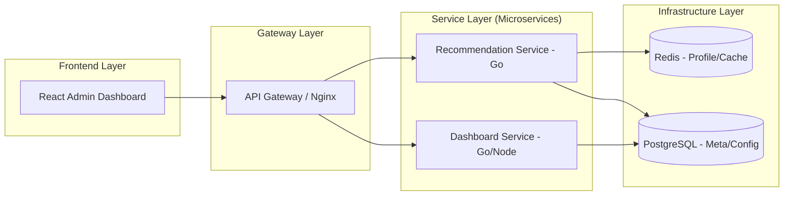
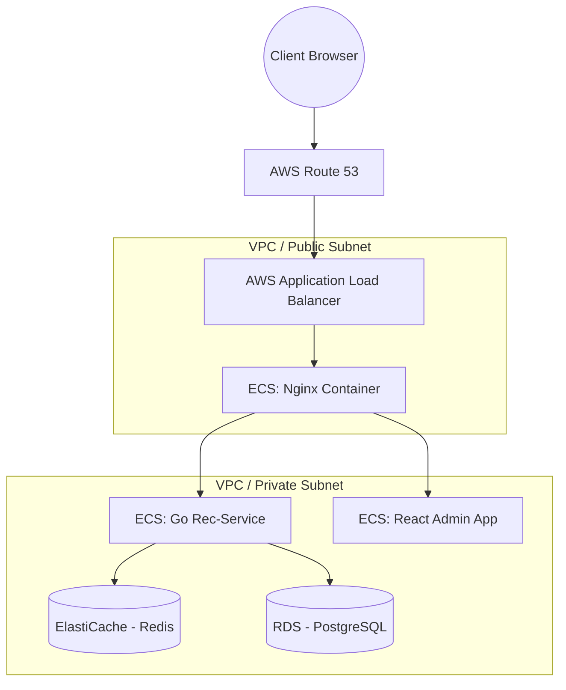
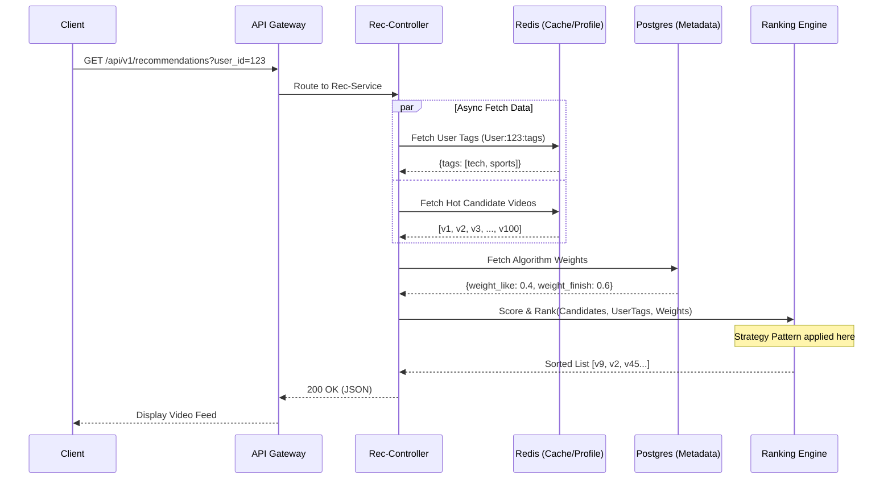
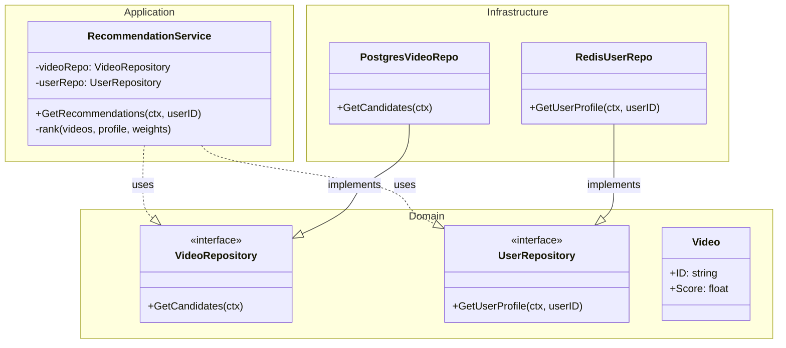
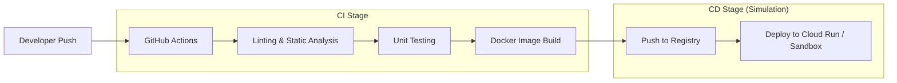
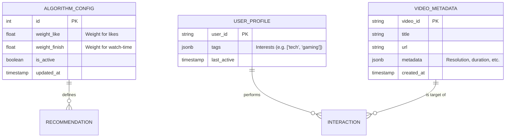

# E-commerce Video Recommendation System - Product & Architecture Overview
## Architecture Blueprint & Project Defense Documentation

> **Authoritative diagrams live in [`docs/architecture/`](docs/architecture/) (PlantUML, kept in sync with the code).**
> The Mermaid sketches below are the original blueprint and are retained for
> historical context only — some are aspirational (e.g. the Clean Architecture
> class diagram, the AWS-only deployment) and no longer match the implementation.

### 1. UML Diagrams (Mermaid)

#### 1.1 Use Case Diagram
```mermaid
useCaseDiagram
    actor "Terminal User" as User
    actor "Admin (Operations)" as Admin
    
    package "Video Recommendation System" {
        usecase "Request Recommendations" as UC1
        usecase "Watch Video" as UC2
        usecase "View System Health" as UC3
        usecase "Configure Algo Weights" as UC4
        usecase "Login to Dashboard" as UC5
    }
    
    User --> UC1
    User --> UC2
    Admin --> UC5
    Admin --> UC3
    Admin --> UC4
    UC3 ..> UC5 : include
    UC4 ..> UC5 : include
```

#### 1.2 DDD Context Map
```mermaid
graph TD
    subgraph "Core Domain"
        RecDomain[Recommendation Domain]
    }
    subgraph "Supporting Domains"
        UserDomain[User Profile Domain]
        ContentDomain[Content/Video Domain]
    }
    subgraph "Generic Subdomain"
        MonitorDomain[Monitoring/Dashboard Domain]
    }
    
    UserDomain -- Shared Kernel --> RecDomain
    ContentDomain -- Customer/Supplier --> RecDomain
    RecDomain -- Published Language --> MonitorDomain
```

#### 1.3 Logical Architecture Diagram


#### 1.4 Physical/Deployment Diagram (AWS)


#### 1.5 Key Use-Case Sequence Diagram: Get Recommendations


#### 1.6 Class Diagram (Clean Architecture Implementation)


#### 1.7 CI/CD Pipeline Flow


---

### 2. Database Design (ER Diagram)


---

### 3. Risks & Mitigations

| Category | Concern | Mitigation |
| :--- | :--- | :--- |
| **Management** | Single-person project burnout/delays. | Scope Phase 1 to "Vertical Slicing" (one path from UI to DB) instead of broad features. |
| **Technical** | Golang concurrency handling for high traffic. | Use `goroutines` for async data fetching and `context` for timeout/cancellation. |
| **Technical** | Cold Start problem for new users. | Fallback to "Globally Popular" category when user tags are missing in Redis. |
| **Security** | Dashboard data leakage. | Implement RBAC (Role Based Access Control) and JWT-based authentication for admins. |
| **Security** | API Abuse / DDoS. | Layer API Gateway rate-limiting and enforce Request ID (trace_id) for logging. |
